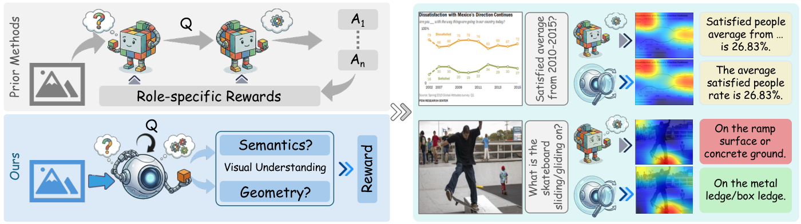
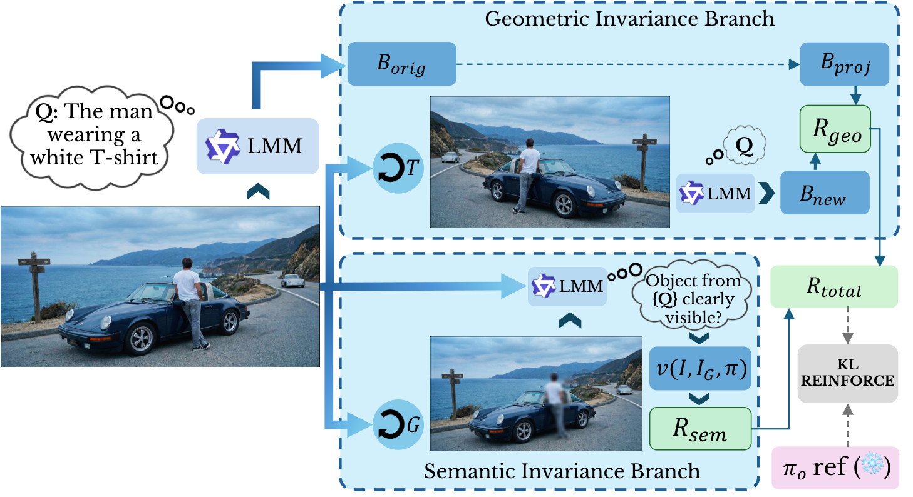
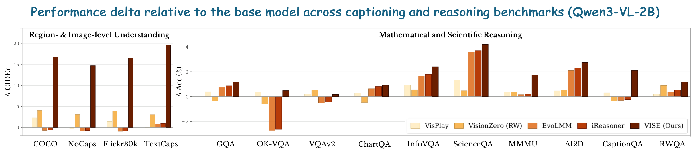
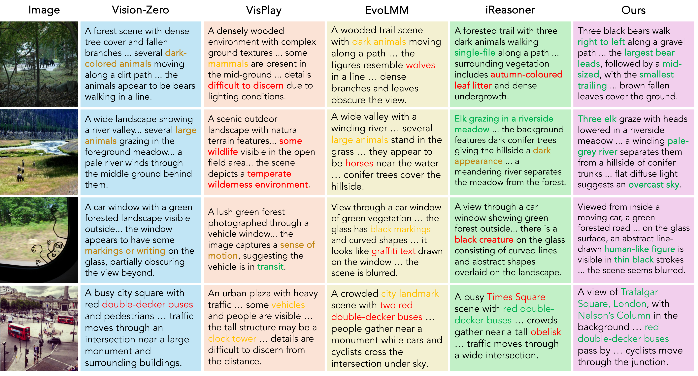
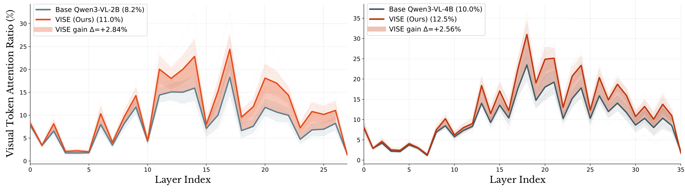
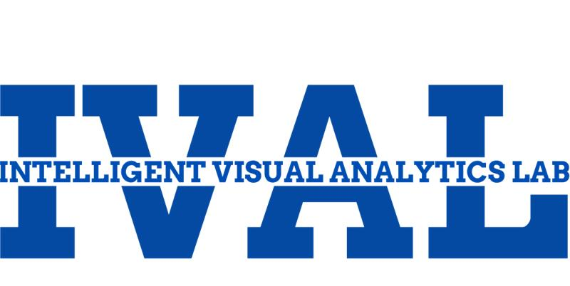
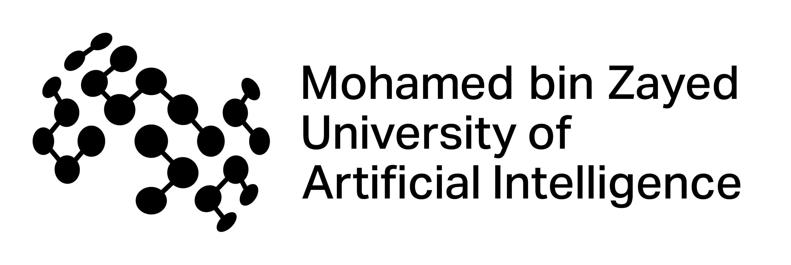

<p align="center">
    
</p>

<div align="center" style="margin:18px 0;">
  
</div>

<h1 align="center">Paying More Attention to Visual Tokens in<br>Self-Evolving Large Multimodal Models</h1>

<p align="center"><b>VISE: Visual Invariance Self-Evolution</b> · ECCV 2026</p>

<div align="center">

[](https://arxiv.org/abs/2606.27373)
[](https://mbzuai-oryx.github.io/VISE/)
[](https://huggingface.co/shravvvv/VISE)
[](LICENSE)

</div>

<p align="center">
  <a href="https://shravfolio.vercel.app">Shravan Venkatraman</a><sup>1</sup>,
  <a href="https://scholar.google.com/citations?hl=en&user=9-2AnjQAAAAJ">Ritesh Thawkar</a><sup>1</sup>,
  <a href="https://omkarthawakar.github.io/">Omkar Thawakar</a><sup>1</sup>,
  <a href="https://scholar.google.fi/citations?user=_KlvMVoAAAAJ">Rao Muhammad Anwer</a><sup>1,2</sup>,<br>
  <a href="https://scholar.google.ae/citations?user=bZ3YBRcAAAAJ">Hisham Cholakkal</a><sup>1</sup>,
  <a href="https://salman-h-khan.github.io/">Salman Khan</a><sup>1,3</sup>,
  <a href="https://sites.google.com/view/fahadkhans/home">Fahad Khan</a><sup>1,4</sup>
</p>

<p align="center">
  <i><sup>1</sup>Mohamed bin Zayed University of Artificial Intelligence · <sup>2</sup>Aalto University · <sup>3</sup>Australian National University · <sup>4</sup>Linköping University</i>
</p>

---

> **TL;DR.** Self-evolving LMMs optimize *answer agreement*, which a decoder can
> satisfy from language priors without ever looking at the image. We call this
> failure mode **visual under-conditioning**. **VISE** replaces answer-agreement
> rewards with two **invariance rewards** (geometric and semantic) computed from
> the model's *own* predictions on **raw, unlabeled images**. As a result, the
> decoder pays measurably more attention to visual tokens, yielding **+16.85 CIDEr
> on COCO**, **+19.66 on TextCaps**, and **-5.0 CHAIR-I** hallucination at 2B, all
> with no task tradeoffs.

<p align="center">
  
</p>
<p align="center"><i>
Prior self-evolving methods use specialist roles optimized for answer consistency.
On chart queries (minimal visual dependence) both prior work and VISE answer
correctly, but on real-scene understanding prior methods fall back on statistically
plausible guesses (a "ramp surface"), while VISE reads the actual evidence (a
"metal ledge").
</i></p>

## 📌 Overview

Recent self-evolving large multimodal models (LMMs) improve visual reasoning in a
purely unsupervised way via multi-role self-play (proposer–solver,
questioner–reasoner) and self-consistency rewards. But optimizing **answer
agreement** does not guarantee that the decoder attends to the image: a model can
be perfectly self-consistent while generating from **language priors**. We term
this **visual under-conditioning**, and it manifests as insufficient attention to
visual tokens during decoding, which causes hallucination, modality bypass, and
unstable grounding even when the vision encoder is accurate.

**VISE (Visual Invariance Self-Evolution)** directly regularizes the model's
**visual-conditioning policy** instead of answer agreement. It runs within a
**single model** (no specialist roles, no external reward models, no annotations)
and trains on **raw, unlabeled images** using two complementary rewards:

| Reward | Question it asks | Signal |
| :-- | :-- | :-- |
| **Geometric Invariance** `R_geo` | Does the model localize the same object consistently under a known spatial transform? | `(GIoU(B_proj, B_new) + 1) / 2` between the box on the transformed view and the analytically projected original box |
| **Semantic Invariance** `R_sem` | If the predicted region is blurred away, does the model notice the evidence is gone? | `1` only if the object is judged *visible* on the original image and *not visible* after **ghosting** |

The composite reward `R = 0.5·R_geo + 0.5·R_sem` is optimized with
**KL-regularized REINFORCE** (adaptive KL coefficient) against a frozen reference
policy.

<p align="center">
  
</p>
<p align="center"><i>
The model generates a localization query and box <code>B_orig</code>. The
<b>Geometric branch</b> transforms the view, re-predicts <code>B_new</code>, and
rewards agreement with the projected box <code>B_proj</code>. The <b>Semantic
branch</b> ghosts the predicted region and rewards the model only if it detects
the object before perturbation and not after. The combined reward is optimized
with KL-regularized REINFORCE against a frozen reference policy.
</i></p>

## ✨ Key Results

VISE improves **all 18 benchmarks** (captioning, VQA, reasoning, and
hallucination) with **no task tradeoffs**, across four scales (2B/4B/8B/32B) and
four backbone families (Qwen3-VL, InternVL3, Gemma-3, Llama-3.2-Vision).

<p align="center">
  
</p>

**Image captioning, CIDEr (Qwen3-VL-2B):**

| Method | COCO | NoCaps | Flickr30k | TextCaps |
| :-- | :--: | :--: | :--: | :--: |
| Base | 21.54 | 19.52 | 26.09 | 22.20 |
| VisPlay | 23.85 | 19.14 | 27.50 | 22.11 |
| VisionZero-RW | 25.58 | 22.61 | 29.94 | 25.28 |
| EvoLMM | 20.84 | 18.75 | 25.15 | 23.04 |
| iReasoner | 20.93 | 18.81 | 25.23 | 23.14 |
| **VISE (Ours)** | **38.39** `+16.85` | **34.25** `+14.73` | **42.64** `+16.55` | **41.86** `+19.66` |

**Hallucination & reasoning (Qwen3-VL-2B, Δ vs. base):**

| CHAIR-I ↓ | CHAIR-S ↓ | POPE ↑ | ScienceQA | InfoVQA | MMMU | CaptionQA |
| :--: | :--: | :--: | :--: | :--: | :--: | :--: |
| **−5.00** | **−5.45** | **+1.02** | **+4.19** | **+2.41** | **+1.75** | **+2.12** |

<p align="center">
  
</p>
<p align="center"><i>
Baselines stay vague ("large animals near a river") or commit to plausible-but-wrong
details ("wolves", "obelisk"). VISE reads the image: three bears of different sizes
walking in order, a hand-drawn figure on a car window, and Trafalgar Square with
Nelson's Column.
</i></p>

### Why it works: more attention to visual tokens

<p align="center">
  
</p>
<p align="center"><i>
Generation-time visual attention per decoder layer. VISE-trained models (orange)
assign more attention to image tokens across mid-to-late decoder layers (mean
<b>+2.84%</b> on 2B, <b>+2.56%</b> on 4B), confirming the shift from
language-prior-driven to image-conditioned decoding.
</i></p>

## 🚀 Installation

```bash
git clone https://github.com/mbzuai-oryx/VISE.git
cd VISE
conda create -n vise python=3.10 -y
conda activate vise
pip install -r requirements.txt
```

## 🔍 Inference with the released model

The released checkpoint is a **LoRA adapter** on `Qwen/Qwen3-VL-2B-Instruct`,
hosted at 🤗 [**shravvvv/VISE**](https://huggingface.co/shravvvv/VISE).

```python
import torch
from PIL import Image
from transformers import AutoModelForVision2Seq, AutoProcessor
from peft import PeftModel

BASE, ADAPTER = "Qwen/Qwen3-VL-2B-Instruct", "shravvvv/VISE"

model = AutoModelForVision2Seq.from_pretrained(BASE, torch_dtype=torch.bfloat16, device_map="auto")
model = PeftModel.from_pretrained(model, ADAPTER)        # attach VISE LoRA
processor = AutoProcessor.from_pretrained(ADAPTER)
model.eval()

image = Image.open("example.jpg").convert("RGB")
messages = [{"role": "user", "content": [
    {"type": "image", "image": image},
    {"type": "text", "text": "Describe this image in detail."},
]}]
text = processor.apply_chat_template(messages, tokenize=False, add_generation_prompt=True)
inputs = processor(text=[text], images=[image], return_tensors="pt").to(model.device)

with torch.inference_mode():
    out = model.generate(**inputs, max_new_tokens=128)
print(processor.batch_decode(out[:, inputs["input_ids"].shape[1]:], skip_special_tokens=True)[0])
```

> 💡 Call `model = model.merge_and_unload()` to fold the LoRA weights into the
> base model for faster inference.

## 🏋️ Training

VISE trains on a folder of **raw, unlabeled images** (we use 4,000 COCO images;
no captions, boxes, or labels are read). Spatial transforms are applied online.

```bash
# edit --data_dir inside the script, then:
bash scripts/train_vise.sh
```

Or call the entry point directly:

```bash
python train.py \
  --data_dir /path/to/images \
  --model_name Qwen/Qwen3-VL-2B-Instruct \
  --use_lora --lora_r 16 --lora_alpha 32 \
  --geo_weight 0.5 --sem_weight 0.5 \
  --total_steps 4000 --lr 1e-6 \
  --kl_target 0.020 --kl_adapt_rate 0.10 \
  --freeze_vision
```

**Key hyperparameters** (2B/4B; see paper for 8B/32B): LoRA `r=16, α=32, dropout=0.05`
· AdamW `lr=1e-6, wd=0.01`, grad clip `1.0` · adaptive KL (target `0.020`, rate `0.10`)
· reward weights `0.5 / 0.5` · ghosting `σ=25` · bfloat16.

## 📂 Repository structure

```
VISE/
├── train.py                 # CLI entry point (argparse -> Config -> VISETrainer)
├── scripts/
│   └── train_vise.sh        # ready-to-edit training launcher
├── vise/
│   ├── config.py            # Config dataclass + LoRA defaults
│   ├── utils.py             # tag parsing, box geometry (IoU/GIoU/projection), transforms + ghosting
│   ├── prompts.py           # self-question / grounding / verification prompts
│   ├── model.py             # ImagePool (data) + VLMCore / VLMRole (loading, generation, log-probs)
│   └── trainer.py           # invariance rewards + KL-REINFORCE updater + VISETrainer loop
├── requirements.txt
└── assets/
```

## 🙏 Acknowledgements

VISE builds on the [Qwen3-VL](https://huggingface.co/Qwen) family and the
🤗 [Transformers](https://github.com/huggingface/transformers) and
[PEFT](https://github.com/huggingface/peft) libraries, and we evaluate with
[lmms-eval](https://github.com/EvolvingLMMs-Lab/lmms-eval). We thank the
open-source community for these tools. This work builds on the line of
self-evolving LMM research including [EvoLMM](https://github.com/mbzuai-oryx/EvoLMM),
[iReasoner](https://meghanaasunil.github.io/iReasoner/), and
[VisPlay](https://bruno686.github.io/VisPlay/).

The computations were enabled by resources provided by NAISS at Alvis (Swedish
Research Council grant 2022-06725), LUMI hosted by CSC (Finland), and Berzelius
provided by the Knut and Alice Wallenberg Foundation at NSC.

## ✏️ Citation

If you find VISE useful, please cite:

```bibtex
@inproceedings{venkatraman2026vise,
  title     = {Paying More Attention to Visual Tokens in Self-Evolving Large Multimodal Models},
  author    = {Venkatraman, Shravan and Thawkar, Ritesh and Thawakar, Omkar and
               Anwer, Rao Muhammad and Cholakkal, Hisham and Khan, Salman and Khan, Fahad Shahbaz},
  booktitle = {European Conference on Computer Vision (ECCV)},
  year      = {2026}
}
```

---

<p align="center">
  <a href="https://www.ival-mbzuai.com"></a>
  &nbsp;&nbsp;&nbsp;
  <a href="https://github.com/mbzuai-oryx"></a>
  &nbsp;&nbsp;&nbsp;
  <a href="https://mbzuai.ac.ae"></a>
</p>
